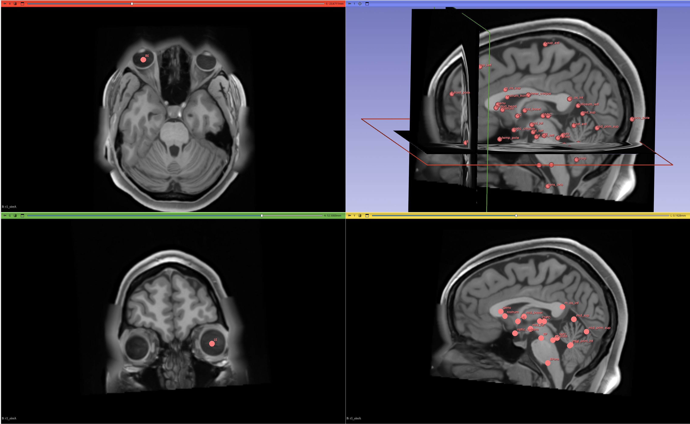

# Multi-Site Brain MRI Landmark Detection and ACPC Alignment

Robust multi-site anatomical landmark detection and ACPC alignment pipeline for heterogeneous brain MRI datasets. This project focuses on reliable landmark localization under strong cross-site domain shift across six simulated MRI acquisition sites.



## Overview

This repository contains a fully reproducible pipeline for:

- Multi-site MRI preprocessing
- Anatomical landmark detection
- ACPC alignment
- Landmark prediction export in 3D Slicer `.fcsv` format
- Cross-site validation and evaluation

The pipeline is designed to generalize across heterogeneous MRI datasets with varying:

- scanner characteristics
- intensity distributions
- spatial resolution
- orientation conventions
- acquisition artifacts


## Objectives

The project goals are:

1. Detect anatomical landmarks from heterogeneous MRI scans
2. Perform robust ACPC alignment
3. Generalize across unseen acquisition sites
4. Generate valid Slicer-compatible landmark files
5. Evaluate robustness under cross-site domain shift


## Dataset

The dataset contains:

- 804 brain MRI subjects
- 6 simulated acquisition sites
- T1-weighted MRI
- T2-weighted MRI
- Tissue posterior probability maps
- Ground-truth landmarks for labeled subjects

## Directory Structure

```text
DATA/
├── siteA/
├── siteA_unlabeled/
├── siteB/
├── siteB_unlabeled/
├── ...
└── siteF_unlabeled/
```

Each labeled subject contains:

```text
subject/
├── t1_siteX.nii.gz
├── t2_siteX.nii.gz
├── BCD_ACPC_Landmarks.fcsv
└── ACCUMULATED_POSTERIORS/
```

## Pipeline Summary

The pipeline consists of:

```text
MRI Input
    ↓
Preprocessing
    ↓
Atlas Registration
    ↓
Initial Landmark Estimation
    ↓
(Optional) Landmark Refinement
    ↓
ACPC Alignment
    ↓
FCSV Export
```


## Preprocessing


## Landmark Detection

The system predicts the following canonical landmarks:

| Landmark | Description |
|---|---|
| AC | Anterior Commissure |
| PC | Posterior Commissure |
| LE | Left Eye Center |
| RE | Right Eye Center |

Additional landmarks may optionally be supported.


# ACPC Alignment

The alignment stage enforces:

- AC at the physical origin
- AC–PC alignment along the anterior–posterior axis
- left/right eye coplanarity for roll correction

This produces a consistent anatomical coordinate system across subjects and sites.


# Validation Strategy

To evaluate robustness under domain shift, the project supports:

- random holdout validation
- leave-one-site-out evaluation
- cross-site generalization testing

Primary metric:

- mean Euclidean landmark localization error (mm)


# Repository Structure

```text
.
├── README.md
├── pyproject.toml
├── uv.lock
├── src/
│   ├── preprocessing/
│   ├── registration/
│   ├── landmarks/
│   ├── alignment/
│   ├── evaluation/
│   └── utils/
├── scripts/
├── notebooks/
├── reports/
├── predictions/
│   ├── siteA_unlabeled/
│   ├── siteB_unlabeled/
│   └── ...
└── tests/
```


# Environment Setup

This project uses `uv` for dependency management.

## Create Environment

```bash
mkdir -p ${NFSSCRATCH}/miatt_final_exam
cd ${NFSSCRATCH}/miatt_final_exam

uv init
```

## Install Dependencies

```bash
uv sync
```


# Recommended Dependencies

Core libraries:

- ITK / SimpleITK
- NumPy
- SciPy
- MONAI
- Matplotlib
- Pandas

Optional visualization tools:

- 3D Slicer
- napari


# Running the Pipeline

## Example

```bash
python scripts/run_pipeline.py \
    --input /path/to/subject \
    --output /path/to/output
```


# Generating Predictions

To generate predictions for all unlabeled subjects:

```bash
python scripts/generate_predictions.py
```

Predictions are written as:

```text
predictions/siteX_unlabeled/<subject>/BCD_ACPC_Landmarks.fcsv
```


# Evaluation

Run validation:

```bash
python scripts/evaluate.py
```

Supported evaluations include:

- per-site performance
- cross-site validation
- landmark localization statistics


# Reproducibility

This repository is designed for reproducible execution.

Reproducibility features include:

- locked dependency versions
- deterministic preprocessing
- modular pipeline design
- script-based execution
- environment isolation via `uv`


# Results

The final system was evaluated under multi-site distribution shift conditions.

Evaluation focuses on:

- landmark localization accuracy
- robustness across sites
- stability under acquisition heterogeneity

Detailed quantitative and qualitative results are included in:

```text
reports/
```


# Future Extensions

Potential future work includes:

- deformable registration refinement
- deep learning landmark localization
- uncertainty estimation
- nonlinear registration initialization
- domain adaptation techniques
- self-supervised anatomical representation learning


## Acknowledgements

This project was developed as part of the Multi-Dimensional Image Analysis Tools (MIATT) coursework and final examination framework.

Special thanks to:

- Dr. Hans Johnson
- ITK, SimpleITK and MONAI communities and
- 3D Slicer developers


## License

This repository is released for educational and research purposes only.
